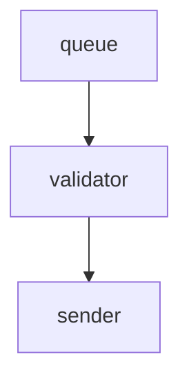
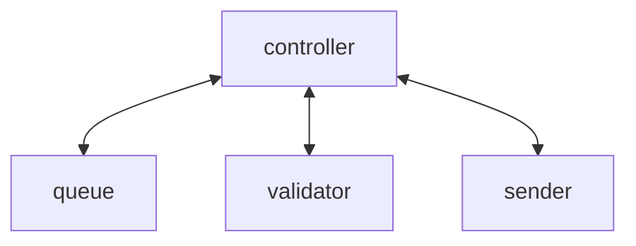

<!-- .slide: data-background="#001219" -->

# Logging

a non-exhaustive opinionated guide

---

<!-- .slide: data-background="#005f73" -->

## Observability

Building predictable systems that you can  
**reason about**

<aside class="notes">
In other words: Can you ask open ended questions about your system?

For example:
- Did the latest release impact performance?
- Is there a correlation between system load and latency?
- Why is kafka partition 2 so hot?
</aside>

--

<!-- .slide: data-background="#005f73" -->

## O11y 1.0 Pillars

- **Metrics** — coarse-grain
- **Logs** — complete freedom!
- **Traces** — fine-grain

<aside class="notes">
- https://www.oreilly.com/library/view/distributed-systems-observability/9781492033431/ch04.html
- https://medium.com/@copyconstruct/logs-and-metrics-6d34d3026e38
</aside>

--

<!-- .slide: data-background="#005f73" -->

## Reality Check

"Pillars" are marketing

Emit **data** to **product** which can **query**.

<aside class="notes">
The product often limits the precision you can include.

Metrics are low-fidelity aggregates, tells you of a failure but not why.

Tracing is logging with opinions + tooling

Multiple sources of truth suffer weak correlation
</aside>

--

<!-- .slide: data-background="#005f73" -->

## O11y 2.0

**Canonical Logs:** Wide and structured

1. Uncover unknown unknowns
2. Useful to everyone

<aside class="notes">
Ask arbitrary questions
Useful to product owners, support, develops, SRE's, Platform engineers, etc.

- https://www.honeycomb.io/blog/why-honeycomb-black-swans-unknown-unknowns-and-the-glorious-future-of-doom
- https://www.thoughtworks.com/en-au/radar/techniques/observability-2-0
- https://thenewstack.io/modern-observability-is-a-single-braid-of-data/
- https://baselime.io/blog/canonical-log-lines
</aside>

--

<!-- .slide: data-background="#005f73" -->

### Actionable:

Focus on good logs

---

<!-- .slide: data-background="#0a9396" -->

## Basics

1. context
2. correlation
3. level

---

<!-- .slide: data-background="#0a9396" -->

## 1. Context

Cannot predict future questions

Add context ✅ not data ⚠️

<aside class="notes">
In future you will want to explore the data in ways you cannot predict today.

Do not add whole request/response payloads, these contain data which your observability tooling is not sancti
</aside>

--

<!-- .slide: data-background="#0a9396" -->

## Example

```json
{
    "time": "2021-07-25T04:12:50Z",
    "application": "authorizer@3.0.1",
    "msg": "authorized",
    "user_id": "123",
    "groups": ["a", "b"],
    "cache_used": "1627186370",
    "request_id": "a39b28c9",
    "corelation_id": "d4289bd7"
}
```

--

<!-- .slide: data-background="#A62E2E" -->

### Common Mistakes

--

<!-- .slide: data-background="#A62E2E" -->

#### message overloading

```json
{
	"msg": "Task finished: ThingProcessor: duration=3.014"
}
```

- hard to parse  
- slow to filter (using `like` operation)  
- ambiguous unit

--

<!-- .slide: data-background="#0a9396" -->

#### message overloading fixed

```json
{
	"msg": "Task finished",
	"processor": "ThingProcessor",
	"duration_ms": 3.014
}
```

--

<!-- .slide: data-background="#e9d8a6" -->

## Architecture

--

<!-- .slide: data-background="#e9d8a6" -->

### Pipe architecture

Q: Which service should log?



<aside class="notes">
Each service might need to, but how to pass context + correlation?
</aside>

--

<!-- .slide: data-background="#e9d8a6" -->

### Controller



The controller handles flow, errors, and logging.

--

<!-- .slide: data-background="#e9d8a6" -->

#### Canonical Example

```go
func (s *Service) Process() (err error) {
	// prepare log context
	start := time.Now()
	log := StandardLogger.WithField("service", "controller")
	defer func() {
		if err != nil {
			log = log.WithError(err)
		}
		duration := time.Since(start)
		log.WithField("duration_ms", duration.Milliseconds()).
			Info("done")
	}()

	// get next work
	var work Work
	work, err = queue.Pop()
	if err != nil {
		return fmt.Errorf("failed to get work: %w", err)
	}
	log = log.WithField("work_id", item.ID)

	// validate
	if err = s.validator.IsValid(work.Body); err != nil {
		return fmt.Errorf("invalid work: %w", err)
	}

	// send
	if err = s.sender.Send(work.Body); !err != nil {
		return fmt.Errorf("failed to send: %w", err)
	}

	// commit work
	work.Delete()
}
```

---

<!-- .slide: data-background="#94d2bd" -->

## 2. Correlation

a cross-component concern — find concensus

--

<!-- .slide: data-background="#94d2bd" -->

Examples

- event context:  
  ```correlation_id, request_id```

- business context:  
  ```user_id, asset_id```

- application context:  
  ```application, version, environment```

--

<!-- .slide: data-background="#94d2bd" -->

### Tooling

reaching consensus through tooling

```golang
package appcontext

type SystemContext struct {
	Application string `json:"application,omitempty"`
	Version	 string `json:"version,omitempty"`
	Environment string `json:"environment,omitempty"`
}

func WithSystemContext(ctx context.Context, val SystemContext) context.Context {
	return context.WithValue(ctx, key, val)
}

func GetSystemContext(ctx context.Context) (val SystemContext, ok bool) {
	val, ok = ctx.Value(key).(SystemContext)
	return
}

...
```

---

<!-- .slide: data-background="#005f73" -->

## 3. Levels

Broadly categorize an event

Reach consensus on meaning

--

<!-- .slide: data-background="#46735E" -->

### Level Definitions

--

<!-- .slide: data-background="#46735E" -->

**fatal:** The system cannot continue

> FATAL: failed to connect to database

--

<!-- .slide: data-background="#46735E" -->

**error:** Failed to do the job

> ERROR: timeout while saving

--

<!-- .slide: data-background="#46735E" -->

**warning:** Processing degraded but can continue

> WARN: config unset; using default

--

<!-- .slide: data-background="#46735E" -->

**info:** System did what you asked it to do

> INFO: user created

> INFO: batch complete

--

<!-- .slide: data-background="#46735E" -->

**debug:** Low-level supporting steps.  

Usually disabled due to poor signal-to-noise ratio.  

__Danger zone:__ Take care with sensitive data!

--

<!-- .slide: data-background="#A62E2E" -->

### Common Mistakes

--

<!-- .slide: data-background="#A62E2E" -->

#### non-ERROR

> ERROR: client is not authorized

This belongs in the response to the client:  
`401 Unauthorized`  

--

<!-- .slide: data-background="#A62E2E" -->

#### non-INFO

Uninteresting plumbing

> INFO: executed 'SELECT * FROM foo'

> INFO: parsed JSON

<small>aka. i was prototyping and accidentally committed it</small>

--

<!-- .slide: data-background="#A62E2E" -->

#### predictions

Predicting the future

> INFO: about to handle request

Trust your error handling!

---

<!-- .slide: data-background="#001219" -->

## Closing

you'll get it wrong the first time; **iterate**
