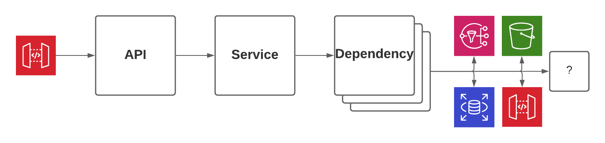

# Logging

---

## What is a log?

> stream of aggregated, time-ordered events ... one event per line ...

— https://12factor.net/logs

---

## Where do logs fit?
<!-- .slide: data-background="#468EAE" -->

Pillars of Observability

- Log 👈
- Metric
- Trace

<aside class="notes">
Reference:
- https://www.oreilly.com/library/view/distributed-systems-observability/9781492033431/ch04.html
- https://medium.com/@copyconstruct/logs-and-metrics-6d34d3026e38
</aside>

---

### Reality Check: metrics
<!-- .slide: data-background="#468EAE" -->

Metrics is low-fidelity event aggregates

Tells you IF failure; but not WHY failure

<aside class="notes">
1. take all your events
2. throw away high-fidelity context (eg. user ID's)
3. store just the number of events
</aside>

---

### Reality Check: tracing
<!-- .slide: data-background="#468EAE" -->

Tracing is logging with opinion + tooling

You can DIY or SaaS:
- AWS X-Ray
- DataDog APM
- honeycomb.io

---

## Logging Examples

See ./examples.md

---

## Context

you cannot predict future questions: be generous

<aside class="notes">
... but consider data sensitivity
</aside>

---

### Context Identifiers

👉 ***Concensus*** 👈

☝

```text
correlation_id / request_id / user_id / asset_id / ...
```

---

### Context Dense

Log infrequently; with rich context

---

### Common Mistakes

---

#### Log-and-Throw

From low-level systems

```go
log.Error("failed")
return err
```

Breach of "Single-responsibility principle"

---

## Levels

A broad category which is important to <span style="text-decoration:underline">collectively agree on</span>.

---

### Common Mistakes
<!-- .slide: data-background="#A62E2E" -->

---

#### non-ERROR
<!-- .slide: data-background="#A62E2E" -->

> ERROR: client is not authorized

401 — a client error!

This belongs in the response to the client; not in logs.

---

#### non-INFO
<!-- .slide: data-background="#A62E2E" -->

Uninteresting plumbing

> INFO: executed 'SELECT * FROM foo'

> INFO: parsed JSON

---

#### predictions
<!-- .slide: data-background="#A62E2E" -->

Predicting the future

> INFO: about to handle request

---

### Level Definitions

---

### fatal
<!-- .slide: data-background="#46735E" -->

The system cannot continue

> FATAL: failed to connect to database

---

### error
<!-- .slide: data-background="#46735E" -->

A transient problem during processing

> ERROR: timeout while saving

---

### warning
<!-- .slide: data-background="#46735E" -->

Processing degraded but can continue

> WARN: config unset; using default

---

### info
<!-- .slide: data-background="#46735E" -->

System did what you asked it to do

> INFO: batch complete

> INFO: cache refreshed

---

### debug
<!-- .slide: data-background="#46735E" -->

Low-level supporting steps.  

Usually disabled due to poor signal-to-noise ratio.  

__Danger zone:__ Take care with sensitive data!

---

## In practice (opinion)



Code falls into 2 flavours:
1. Business Logic
2. Plumbing

As such: only your service layer should log as "INFO"

---

### Observer pattern

---

## TL;DR;

- DONT : write stories over many lines
- DO : emit discreet, context-rich events

---

misc

- you'll get it wrong the first time; iterate
- single respo: dont log and throw
