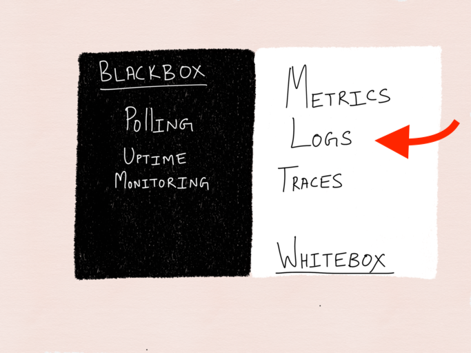

# logging


--

stories are for humans

logs are for computers, stop writing stories

---

## Where do logs fit?

--

## Pillars of Observability


<small>https://medium.com/@copyconstruct/logs-and-metrics-6d34d3026e38</small>

NOTE:

metrics are low-fidelity (aggreated)

logs are high-fidelity (detailed)

questions of your system will start with logs, and promote to metrics

---

## What is a Log?

--

## A log is ...

<small>https://12factor.net/logs</small>

<small>... the stream of aggregated, time-ordered events ...</small>  
<small>... one event per line ...</small>  

--

## A log has levels

- __fatal__ - the system cannot continue
- __error__ - an isolated problem
- __warning__ - processing degraded
- __info__ - a core function happened <<< **_events!_**
- __debug__ - for SME to troubleshoot process flow

NOTE: as the SME of your application you decide what is interesting

---

## A log is not ...

```js
console.log("111")
load()
console.log("here!")
process()
console.log("works")
```

<small>_the poor mans debugger ...._</small>

NOTE: a dumping ground of spur-of-the-moment troubleshooting

--

## Do not 

- Don't emit creds
- Don't spam

☠️️

--

## Do 

- Do provide context
- Do iterate

☑️

NOTE: Hard balance to strike - feedback cycle important

---

## Example 1

code

```js
console.info( "adding numbers ..." )
const result = add( [1, 2, 3] )
console.info( "done" )
 
function add(numbers: number[]) {
    console.info( numbers )
    const result = numbers.reduce( (sum, num) => sum + num )
    console.info( result )
    return result
}
```

--

## Example 1

output

```json
adding numbers ...
[ 1, 2, 3 ]
6
done
```

NOTE: this is "Poor mans debugger"

--

## Example 1

at scale

```json
adding numbers ...
adding numbers ...
[ 1, 2, 3 ]
[ 3, 2, 1, 0, -1 ]
6
done
5
[ 10, 20, 30 ]
[ 1, 2, 3 ]
adding numbers ...
done
done
adding numbers ...
6
adding numbers ...
done
done
...
```

---

## Example 2

code

```js
const numbers: number[] = [1, 2, 3]

try {
    const result = add( numbers )
    logger.info( "numbers added", {numbers, result} )
} catch (error) {
    logger.error( "failed to add numbers", {numbers, error} )
}

function add(numbers) {
    return numbers.reduce( (sum, num) => sum + num )
}
```

--

## Example 2

output

```json
{
  "_logLevel": "info",
  "msg": "numbers added",
  "numbers": [1, 2, 3],
  "result": 6,
}
```

--

## Example 2

at scale

```json
{
  "_logLevel": "info",
  "msg": "numbers added",
  "numbers": [1, 2, 3],
  "result": 6,
}
{
  "_logLevel": "error",
  "msg": "failed to add numbers",
  "numbers": [1, "two", "🥑"],
  "error": "Error: no...",
}
{
  "_logLevel": "info",
  "msg": "numbers added",
  "numbers": [1, 2, 3],
  "result": 6,
}
```

---

## Tooling

<small>lots</small>

--

## cli

show me errors

```bash
cat ./logs/*.json | sort \
| jq '. | select( ._logLevel == "error" )'
```

&nbsp;

show me a request

```bash
cat ./logs/*.json | sort \
| jq '. | select( .correlationId == "abcd" )'
```

--

## CloudWatch

show me errors

```
{ $._logLevel = "error" }
```

&nbsp;

show me a request

```
{ $.correlationId = "abcd" }
```

--

## CloudWatch Insights

show me errors over time

```bash
filter _logLevel = "error" | count(*) by bin(1m)
```

&nbsp;

show me utilization by time

```bash
filter msg = "processing" | sum(count) by bin(1m)
```

--

## Sumo

show me errors

```
_sourceHost=/aws/lambda/*-input-processor-*
| json auto | where %"message._loglevel" = "info"
```

--

etc ...

---

## tl;dr;

&nbsp;

#### Stop ✋
writing sagas

&nbsp;

#### Start 👌
emitting events  
doing ops  

NOTE:  

you won't get it right the first time

iterate: do dev, do ops, do devops

--

end
